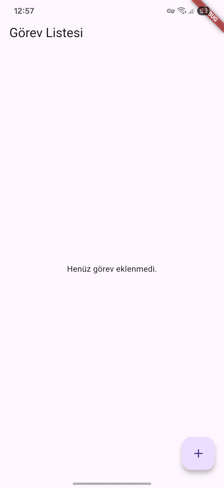
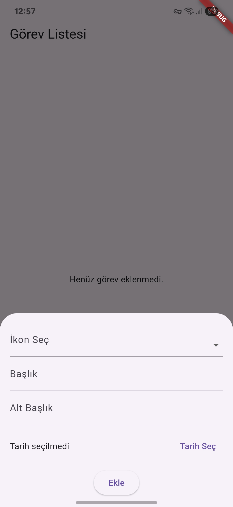
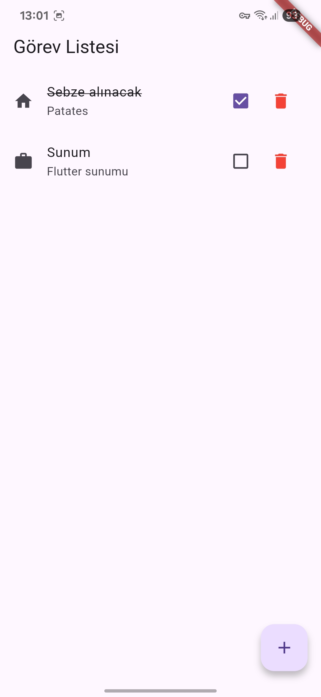

## Flutter Firebase ToDo App

A simple, cross-platform ToDo application built with **Flutter** and integrated with **Firebase Firestore** for real-time task management.

---

## Features

- ✅ Add and delete tasks

- ✅ Mark tasks as completed

- ✅ Real-time data updates using Firebase Firestore

- ✅ Cross-platform support: Android, iOS, Web, Windows, Linux, and macOS

---

## Screenshots








---

## Getting Started

### Prerequisites

- Flutter SDK installed ([Flutter Install Guide](https://flutter.dev/docs/get-started/install))

- Firebase account ([Firebase Console](https://console.firebase.google.com/))

- Android Studio, VS Code, or any preferred IDE

### Firebase Setup Requirement

> **Important:** This project requires **your own Firebase account**. You must create a Firebase project and configure your own Firebase credentials.

1. Go to [Firebase Console](https://console.firebase.google.com/), create a project.

2. Add an Android app to your Firebase project and download the `google-services.json` file.

3. Place the `google-services.json` file inside the `/android/app/` directory.

4. For iOS, follow Firebase iOS setup steps and add `GoogleService-Info.plist` to `/ios/Runner/`.

Without these steps, the app **will not connect to Firebase**.

---

## Installation

1. **Clone the repository**

```bash
git clone https://github.com/your-username/flutter-firebase-todo-app.git
cd flutter-firebase-todo-app
```

2. **Install dependencies**

```bash
flutter pub get
```

3. **Run the app**

```bash
flutter run
```

> Ensure your emulator or device is connected.

---

## Folder Structure

```
lib/
├── models/        # Data models (TodoModel)
├── services/      # Firebase Firestore service (FirestoreService)
├── widgets/       # UI components (AddTodoSheet, TodoTile)
└── main.dart      # App entry point
```

---

## Project Files Overview

- **lib/models/todo_model.dart** - Defines the task structure.

- **lib/services/firestore_service.dart** - Manages Firestore read/write operations.

- **lib/widgets/add_todo_sheet.dart** - Bottom sheet to add new tasks.

- **lib/widgets/todo_tile.dart** - List item widget to display tasks.

- **lib/main.dart** - Application entry point with StreamBuilder for live task updates.

---

## Author

- ([AlperenSamurlu (Alperen Samurlu) · GitHub](https://github.com/AlperenSamurlu))
